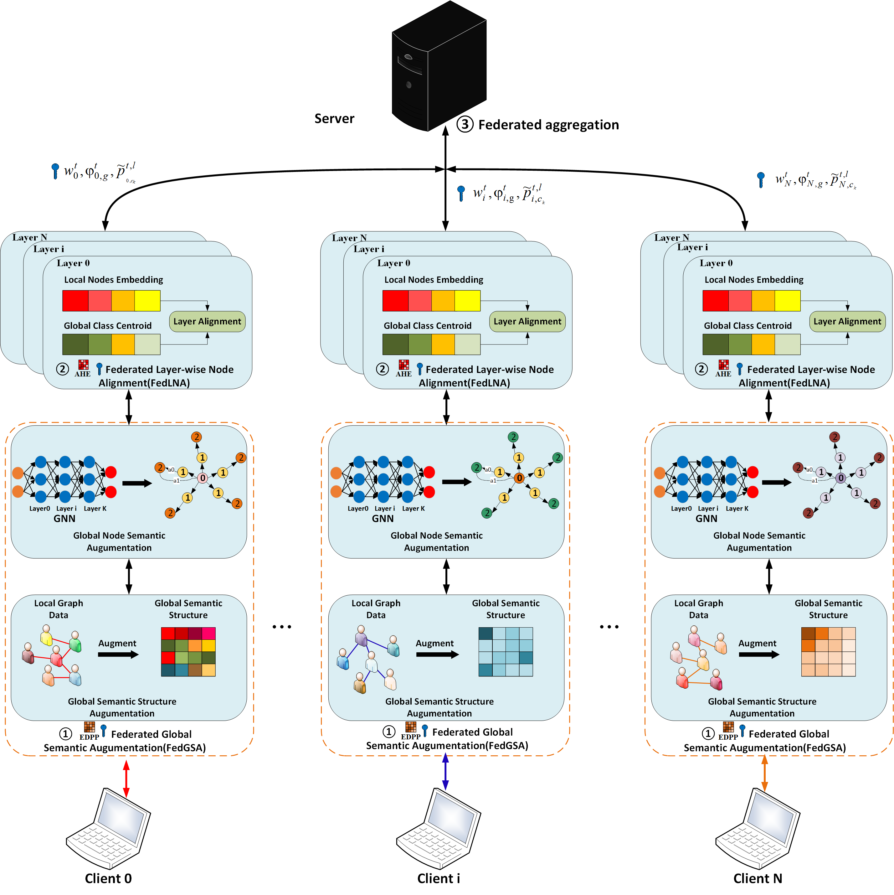

# PPFedSALA
Handling distributed structured data while ensuring privacy protection is an urgent issue that needs to be addressed in areas(such as recommendation systems and traffic flow prediction). Most current federated graph learning research relies on federated learning to improve the heterogeneity of model parameters from different perspectives, but there are still many shortcomings. This study takes a novel perspective, aiming to address the non-independent and identically distributed(Non-IID) issue in distributed graph data from the aspects of graph structure and node attribute distribution. To this end, the study proposes Federated Graph Neural Network Learning with Global Semantic Augumentation and Layer-wise Node Alignment under Non-IID conditions (FedSALA). Based on the constructed global semantic structure, the node representations obtained from each layer of the graph convolution are respectively augmented and aligned in terms of semantics and node distribution, making the local distribution approximate the global distribution. This study validates the FedSALA method on four social datasets, achieving accuracies of 0.893, 0.747, 0.59, and 0.89, respectively. Furthermore, FedSALA demonstrates good convergence and visualization, outperforming existing federated learning methods such as FedGCN. By ablating the global semantic augumentation module, we can obtain richer global information. Through layer-wise node alignment ablation, we found that simultaneously handling intra-class nodes and inter-class centroids across different layers better aligns local and global node distribution. Finally, we compared the performance of different federated learning algorithms across multiple clients, further demonstrating the scalability of the FedSALA method.

# Framework

# DataSet
The experimental dataset includes Cora[1], Citeseer[2], BlogCatalog[3], Facebook[4] and TeleComm[5] datasets, you can download it yourself on the Internet.

# Experimental environment
+ torch == 2.2.2
+ pandas == 1.22.0
+ networkx == 3.1
+ matplotlib == 3.7.1
+ numpy == 1.22.0

# Reference
- [1] A. K. McCallum, K. Nigam, J. Rennie, and K. Seymore, “Automating the construction of internet portals with machine learning,” Information Retrieval, vol. 3, pp. 127–163, 2000.
- [2] C. L. Giles, K. D. Bollacker, and S. Lawrence, “Citeseer: An automatic citation indexing system,” in Proceedings of the third ACM conference on Digital libraries, 1998, pp. 89–98.
- [3] L. Tang and H. Liu, “Relational learning via latent social dimensions,” in Proceedings of the 15th ACM SIGKDD international conference on Knowledge discovery and data mining, 2009, pp. 817–826.
- [4] B. Viswanath, A. Mislove, M. Cha, and K. P. Gummadi, “On the evolution of user interaction in facebook,” in Proceedings of the 2nd ACM workshop on Online social networks, 2009, pp. 37–42.
- [5] X. Hu, H. Chen, S. Liu, H. Jiang, G. Chu, and R. Li, “Btg: A bridge to graph machine learning in telecommunications fraud detection,” Future Generation Computer Systems, vol. 137, pp. 274–287, 2022.
